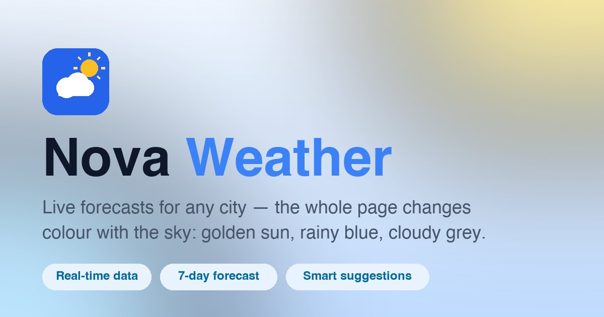

<div align="center">



# ⛅ Nova Weather

**Live forecasts & smart suggestions — the whole page changes colour with the sky.**


</div>

## ✨ Features

- **Live weather for any city** — search a city name and get real-time conditions powered by the [Open-Meteo](https://open-meteo.com/) API (free, no API key required).
- **The page *is* the forecast** — the entire page repaints with the sky: golden for sun, rainy blue, frosty snow, deep indigo nights, electric storms.
- **7-day outlook** — daily highs/lows with per-condition Lottie animations.
- **Smart suggestions** — contextual advice ("Take an umbrella", "Wear warm clothes") based on conditions and temperature.
- **Day & night aware** — clear skies switch to a moonlit night theme automatically.
- **Polished states** — skeleton loaders, themed error pages (404, no location, city not found, network failed), all with branded Lottie animations.
- **Installable** — web manifest, favicons and OG/social preview image included.

## 🛠 Tech Stack

| Layer | Tools |
| --- | --- |
| UI | [React 19](https://react.dev/) + [React Router 8](https://reactrouter.com/) |
| Styling | [Tailwind CSS 4](https://tailwindcss.com/) with a custom Nova design system |
| Animations | [lottie-react](https://github.com/flow-diary/lottie-react) weather scenes, [lucide-react](https://lucide.dev/) icons |
| Build | [Vite 8](https://vite.dev/) |
| Data | [Open-Meteo](https://open-meteo.com/) — Forecast API + Geocoding API |
| Hosting | [Vercel](https://vercel.com/) (SPA rewrites configured in `vercel.json`) |

## 🚀 Getting Started

```bash
# 1. Clone the repository
git clone https://github.com/khalidhasan-m/Nova-Weather.git
cd Nova-Weather

# 2. Install dependencies
npm install

# 3. Start the dev server (http://localhost:5173)
npm run dev
```

## 📜 Scripts

| Command | Description |
| --- | --- |
| `npm run dev` | Start the Vite dev server with HMR |
| `npm run build` | Build the production bundle to `dist/` |
| `npm run preview` | Preview the production build locally |
| `npm run lint` | Run ESLint over the project |

## 📁 Project Structure

```
src/
├── components/        # Feature components (WeatherCard, ForecastCard, LocationModal…)
│   └── ui/            # Reusable primitives (Card, Pill, Modal, Skeleton, buttons)
├── layouts/           # Route layouts
├── pages/             # Route pages (Home, Weather, ErrorPage)
├── services/          # Open-Meteo API clients (geocoding + forecast)
├── utils/             # Weather-code mapping, theming, suggestions
└── index.css          # Tailwind + Nova design tokens
public/
├── animations/        # Lottie scenes (per weather condition & advice)
├── favicon.svg        # Brand favicon (sun + cloud)
├── og-image.png       # 1200×630 social preview
└── site.webmanifest   # PWA manifest
```

## 🚢 Deployment

The project deploys to **Vercel** out of the box — `vercel.json` already rewrites all routes to `index.html` so client-side routing (e.g. `/weather`) works on refresh.

```bash
npm i -g vercel
vercel --prod
```

## 🙌 Credits

- Weather & geocoding data by [Open-Meteo](https://open-meteo.com/) (CC BY 4.0)
- Weather animations from LottieFiles
- Built with ❤️ by [Khalid Hasan](https://github.com/khalidhasan-m)
